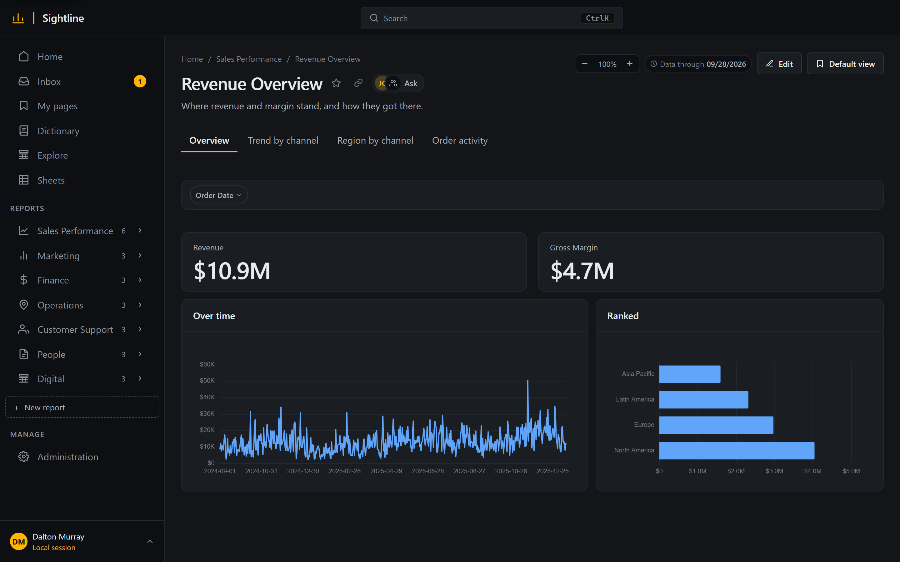
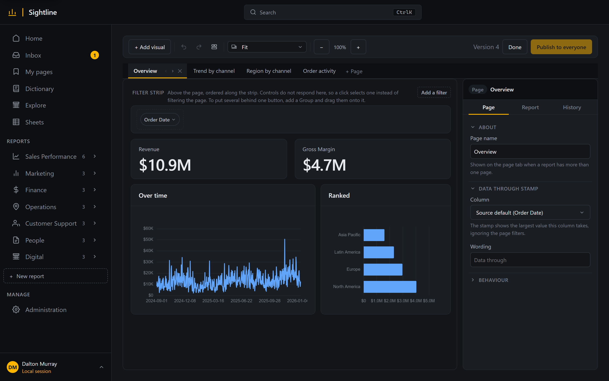
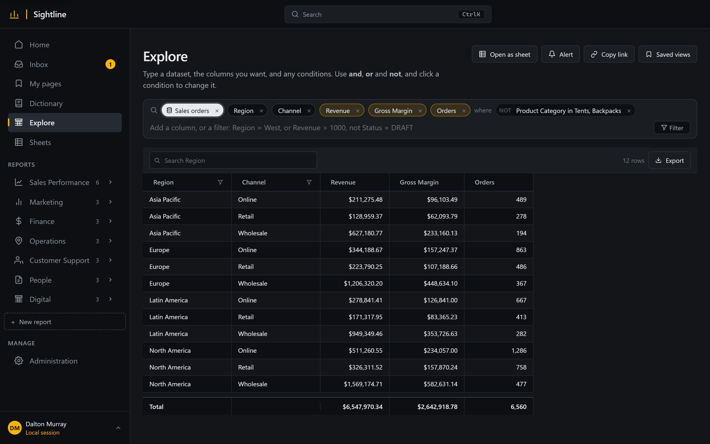
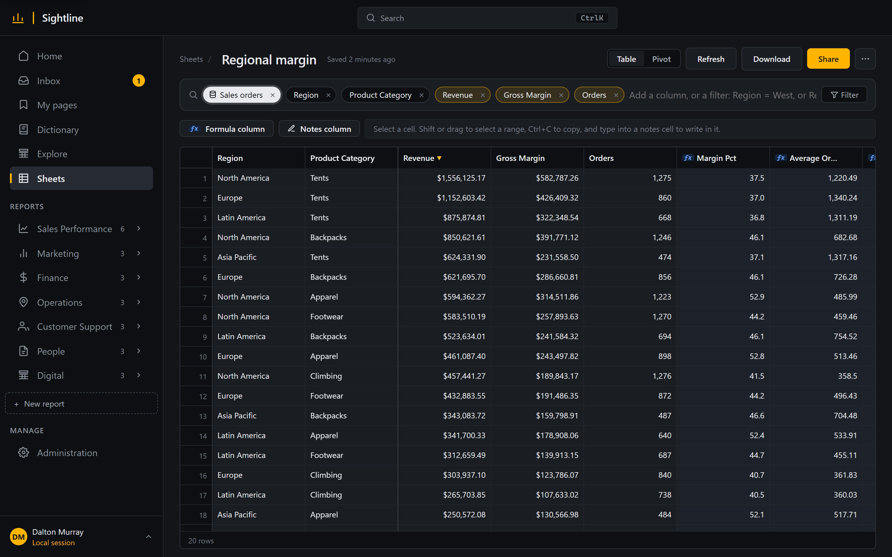
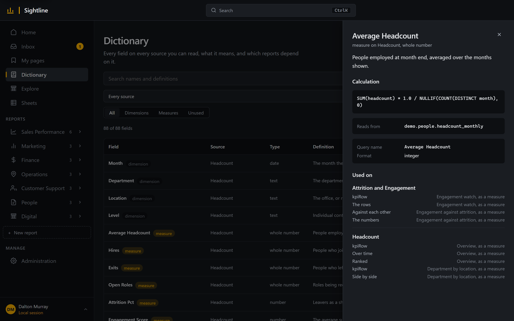
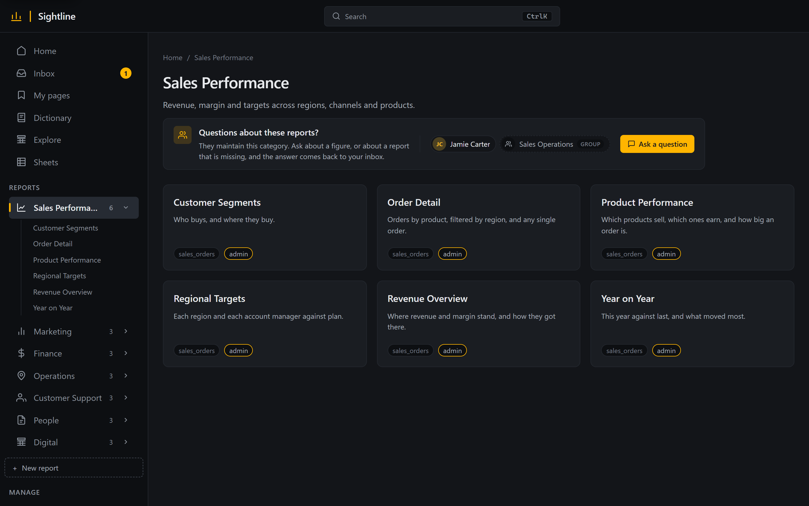
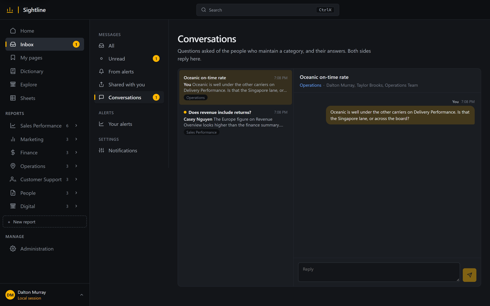
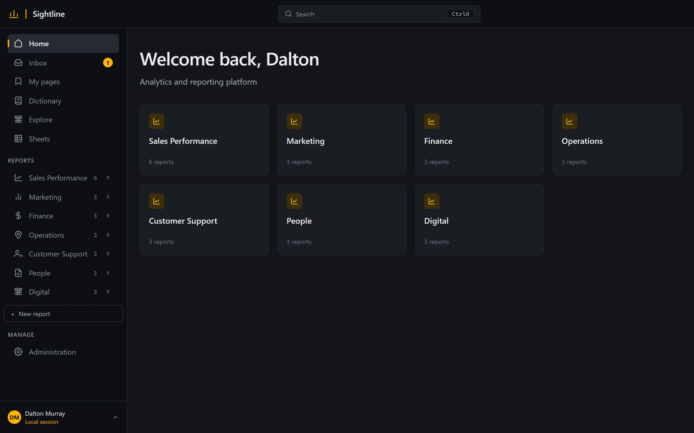
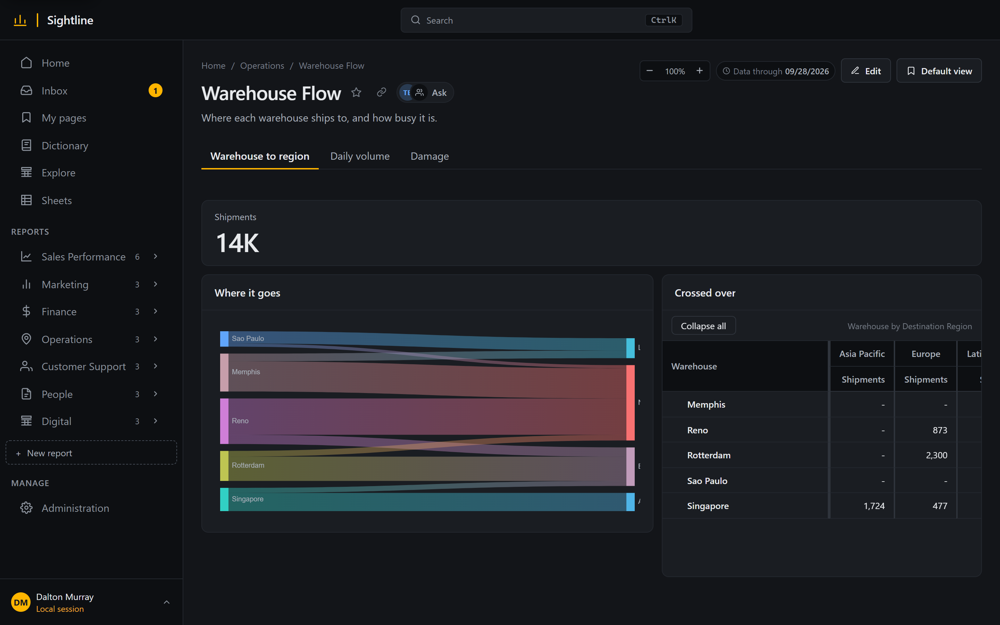
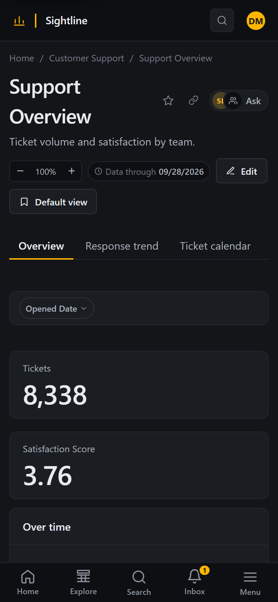

<p align="center">
  
</p>

<h1 align="center">Sightline</h1>

<p align="center">
  A self-serve reporting platform that runs as a Databricks App.<br>
  One shared definition per report, and everyone keeps their own view of it.
</p>

<p align="center">
  
</p>

---

## What it is for

Reporting tools usually force a choice. Either a central team owns every
report and each change is a ticket, or everyone builds their own and no two
numbers agree. What people want is "this report, but with my columns".

Here a report has one definition that a central group edits and publishes, and
each reader keeps their own columns, filters, sizes and sort on top of it. A
saved view records the differences from the report rather than a copy, so
an editor's new measure reaches everyone, personalised or not.

## What it does

- **Reports** built on a grid from page templates, edited live by several
  people, with version history and per-reader saved views.
- **Row-level security by construction.** Every query runs under the reader's
  own token, so Unity Catalog applies their filters and masks.
- **A cache that never leaks.** Answers are shared only between readers who
  provably see the same rows. Sources can be scheduled or live, and live pages
  update themselves.
- **Explore**, a table built from one search bar with AND, OR, NOT and
  brackets, saved by name or shared by link.
- **The dictionary**, every field's definition and every report that uses it.
- **Sheets**, live tables with formula and notes columns, pivots and presence.
- **Alerts and an inbox**, with push to phones and computers.
- **Asking the maintainers**, two-way messages to a category's editors,
  people or groups.
- **A data assistant** that queries through the same layer, when a model
  endpoint is configured.
- **Works on a phone** and installs as an app.

## A look around

| | |
| --- | --- |
|  |  |
|  |  |
|  |  |
|  |  |

<p align="center">
  
</p>

*These are from the offline demo.*

## Getting started

Against a Databricks workspace:

```bash
cp backend/ui/.env.example backend/ui/.env   # then fill it in
npm install
npm run dev
```

Or with no workspace at all, on sample data:

```bash
npm install
npm run dev2
```

`dev2` runs an offline demo at `http://localhost:3001` on a local Postgres,
with seven categories of sample reports. See
[development](docs/development.md#the-offline-demo).

## Documentation

| Document | Covers |
| --- | --- |
| [Architecture](docs/architecture.md) | How queries run as the reader, who can open what, caching and freshness, page loading |
| [Features](docs/features.md) | Reports, export, the dictionary, Explore, the assistant, Sheets, alerts, messaging, mobile |
| [Administration](docs/administration.md) | The admin panes, category editor roles, sources and caching, notifications |
| [Deploying](docs/deployment.md) | Configuration, the platform schema, catalogue grants, user authorization, the assistant endpoint, push |
| [Development](docs/development.md) | Local setup, the offline demo, tests, repository layout |
| [Security](SECURITY.md) | Reporting a vulnerability |

## Licence

MIT.
